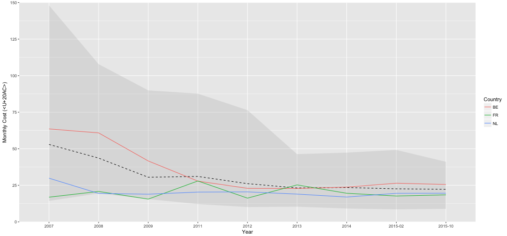

Trends in European internet connection prices
========================================================
author: Oliver Hofkens 
date: 09/07/2017
autosize: true

Introduction
========================================================

Internet connection prices and speeds vary highly across Europe.  
This small application allows the user to compare different countries and 
see trends in the price versus the speed of the connection.

Links:
* [Application](https://blarfursnarg.shinyapps.io/comparison_of_prices_of_internet_access_across_europe/)
* [Source Code](https://github.com/OliverHofkens/DDDCourseProject3)

Data
========================================================

The European Union publishes a lot of public data via the [European Union Open Data Portal](http://data.europa.eu/euodp/en/data/).  
This specific application uses the ['Monthly price of standalone internet access'](https://data.europa.eu/euodp/en/data/dataset/nu6TLMS46TeSDUKnHAkw) data set, which is part of the 'Digital Agenda Scoreboard' initiative which tries to strengthen the European digital economy and society.  
The data in question has the following format:  


```r
internetPrices <- read.csv("Application/data/internet-price.csv")
summary(internetPrices)
```

```
  time_period     ref_area                 indicator  
 2014   :114   EU27   : 31   price_internet_only:783  
 2013   :112   FI     : 31                            
 2015-02:112   SE     : 31                            
 2015-10:112   SI     : 31                            
 2012   : 86   BG     : 30                            
 2011   : 84   DK     : 30                            
 (Other):163   (Other):599                            
             breakdown             unit_measure     value        
 offer_100_mbps   :107   minimum_euro_ppp:783   Min.   :  6.699  
 offer_12_30_mbps :253                          1st Qu.: 19.526  
 offer_30_100_mbps:204                          Median : 27.902  
 offer_8_12_mbps  :219                          Mean   : 33.004  
                                                3rd Qu.: 39.273  
                                                Max.   :148.086  
                                                                 
```

Slide With Plot
========================================================


